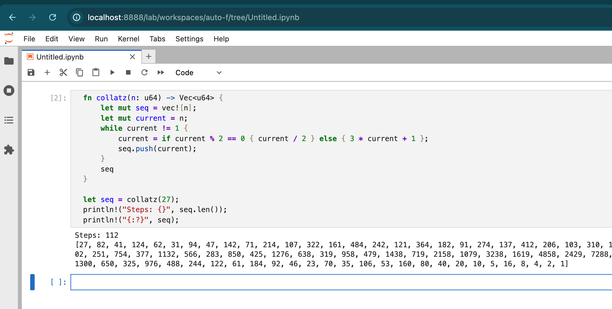

# rustyjupyter

Nix flake template for a Jupyter Lab environment with a Rust kernel.

## Usage

```sh
mkdir my-project && cd my-project
nix flake init -t github:encodepanda/rustyjupyter
nix develop
jupyter lab
```

## Example

See [rust-examples.ipynb](template/rust-examples.ipynb) for a sample notebook with Rust code.


